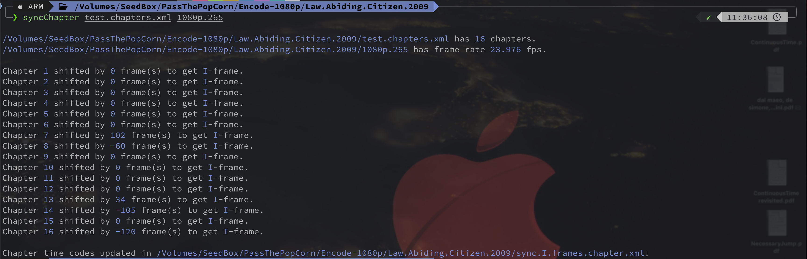
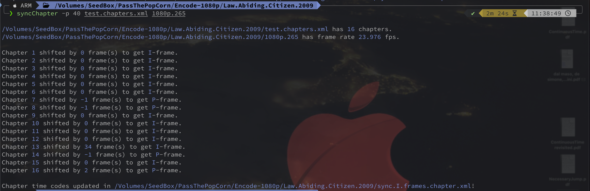

# sync-chapter-I-frame

## Description

When you have sync'ed chapters coming from another source to a video file, you may wish, as a final step, to slightly shift the timecodes to the nearest I-frame.  This script automates that final step, although it will be sometimes better to do it manually with a human being taking the best decisions.  The script takes a Matroska chapter file (either xml or txt) and a video file as inputs and generates a new chapter file with timecodes approprately shifted.

## Requirement

This script needs a working installation of `VapourSynth` with `ffms2` indexer and the `mediainfo` commandline.


## Screenshots




## Usage

```
usage: syncChapter.vpy [-h] [-p PFRAME] chapter video

This script change timecodes in a xml/txt chapter file to match the nearest I-frame of a video file (or a P-frame if the nearest I-frame is too far)

positional arguments:
  chapter              Absolute or relative path to xml/txt chapter file
  video                Absolute or relative path to mkv/hevc/265/avc/264 video file

options:
  -h, --help           show this help message and exit
  -p, --pframe PFRAME  Maximal admissible distance to nearest I-frame
```

If the -p option is not provided, then the script will always search for the nearest I-frame, no matter how far it is.If this option is given with an integer argument, the script will first search for an I-frame within the admissible range and fall back to the nearest P-frame if no I-frame is found within the admissible range.

## Features

The script genererates a new xml/txt chapter file with all timecodes updated. It prints on stdout the number of frames by which each chapter has been shifted and if the corresponding new frame is a I-frame or a P-frame.
